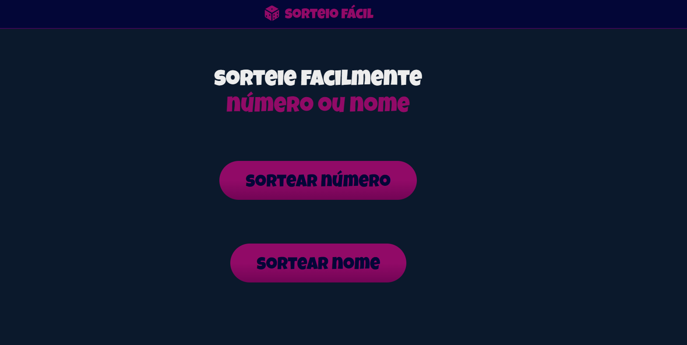
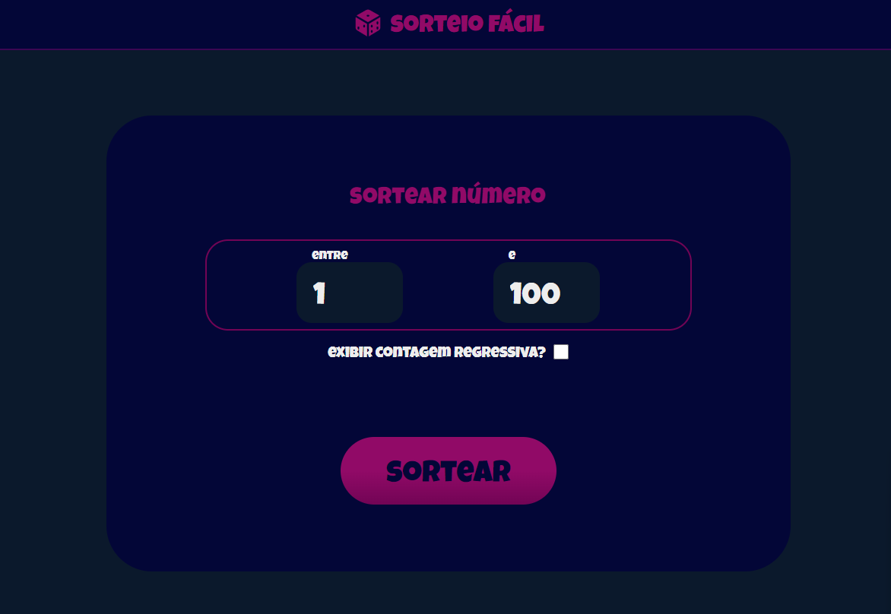
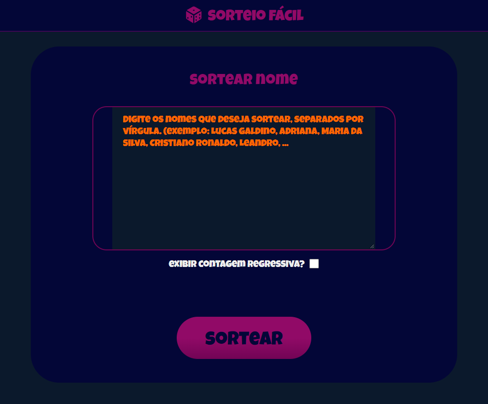
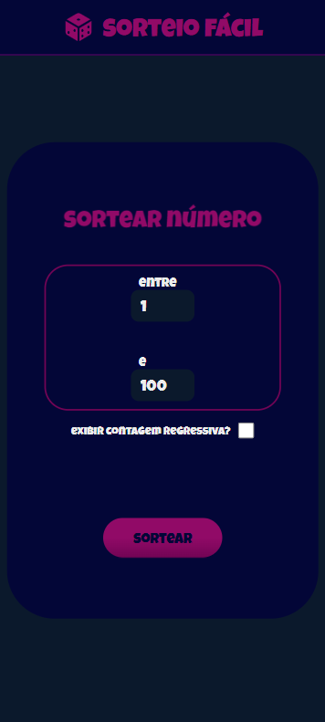

<h1>Sorteio Fácil</h1>

<h5>Website para realizar sorteio fácil de nome e número.</h5>

<h4>Tecnologias usadas:</h4>

<h3>Link da aplicação <a href="https://lucasfgaldinos.github.io/sorteio-facil">aqui</a></h3>

  
  
  
  

# React + Vite

This template provides a minimal setup to get React working in Vite with HMR and some ESLint rules.

Currently, two official plugins are available:

- [@vitejs/plugin-react](https://github.com/vitejs/vite-plugin-react/blob/main/packages/plugin-react/README.md) uses [Babel](https://babeljs.io/) for Fast Refresh
- [@vitejs/plugin-react-swc](https://github.com/vitejs/vite-plugin-react-swc) uses [SWC](https://swc.rs/) for Fast Refresh
